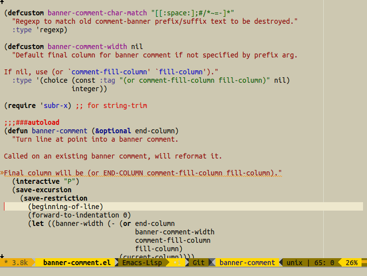

# Emacs package banner-comment

Trivial Emacs package to format a comment as a banner.  Will reformat
an existing banner.



The only defun provided is `banner-comment`.  Suggested `use-package` initialization:

``` emacs-lisp
(use-package banner-comment
  :commands (banner-comment)
  :bind ("C-c h" . banner-comment))
```

Submit issues or PRs if you need something more from it!
